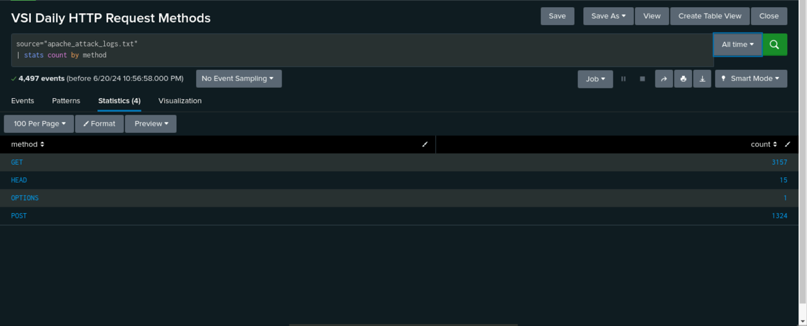
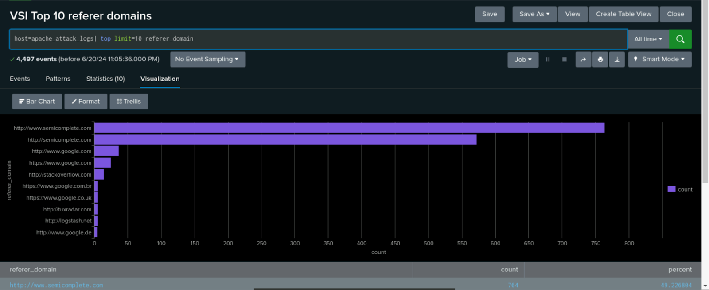
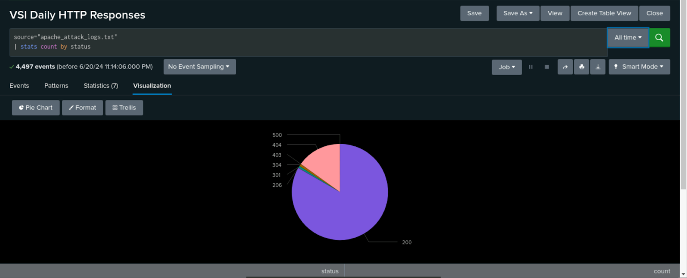
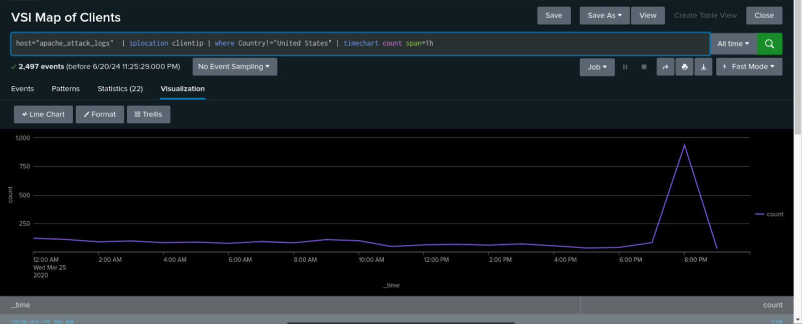
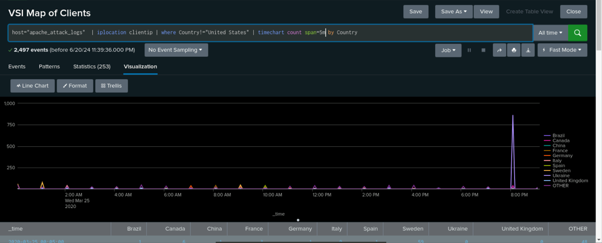
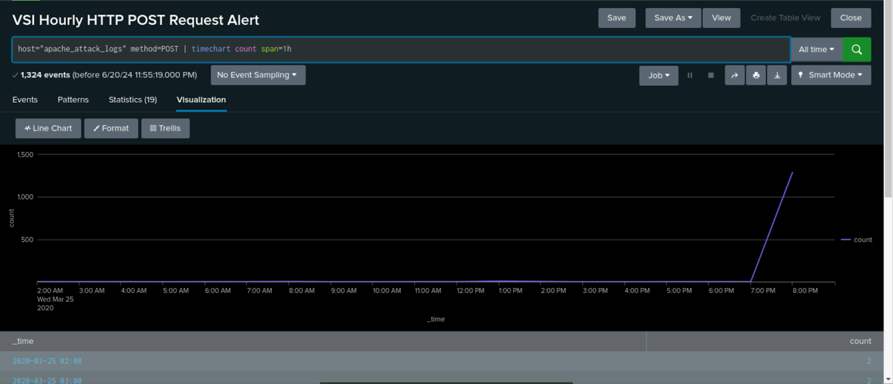
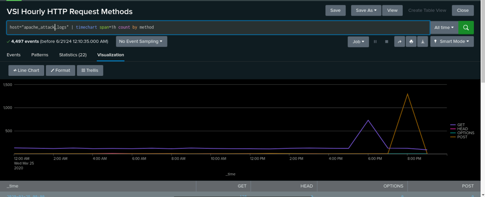

<h5>Directory</h5> 

<b>[Tech Portfolio Home](https://github.com/Jays1115/Jalen-Smith.git)</b>

# VSI Is Under Attack

Scenerio: As a SOC Analyst at Virtual Space Industries (VSI), a company specializing in virtual-reality programs for businesses, I was tasked with investigating potential cyber threats. VSI received intelligence indicating that a competitor, JobeCorp, may be planning to launch cyberattacks to disrupt VSI’s business operations.
<br>
<br>
Assignment: The VSI product assigned for monitoring is an Apache web server, which hosts the administrative webpage. The networking team has provided past logs to assist in developing baselines for normal activity, as well as creating reports, alerts, and dashboards to effectively monitor for suspicious activity and potential threats.

<h2>Creating Reports, Alerts, & Visualizations From the Apache Logs</h2>
After uploading the provided logs from the Apache web server, I designed the following reports, alerts, & visualizations to assist VSI in quickly identifying specific information.
<br>
<br>

<p align="center">
<br/>
This is a report that shows a table of the different HTTP methods (GET, POST, HEAD, etc.). This will provide insight into the type of HTTP activity being requested against VSI’s web server.
<br/>

<br/>
<br/>
This report shows the top 10 domains that refer to VSI’s website. This will assist VSI with identifying suspicious referrers.
<br/>

<br />
<br />
This is a report that shows the count of each HTTP response code. This will provide insight into any suspicious levels of HTTP responses.
<br/>

<br/>
<br />
This is a line chart that shows the volume of international website activity. This will provide insight into suspicious volume of international activity.
<br/>

<br />
<br />
This is a report that shows the volume of HTTP POST request codes to the web server. This will provide insight into the volume of HTTP POST request to the server. I used this report to determine the baseline of hourly HTTP POST requests and created an alert that would send an email to SOC@VSI-company.com when HTTP POST requests exceeded 5 request per hour.
<br/>

<br />
<br />
This is a report that shows the hourly count of each HTTP request method to the server. This will provide insight into any suspicious spikes iin any HTTP request to the server.
<br/>

<br/>
<br/>

 
<h2>Analyzing Reports & Visualizations From the Apache Logs After an Attack</h2>
After designing the above reports, alerts, and visualizations to proactively monitor for threats, an attack occurred, triggering the security systems. This incident provided an immediate test of the newly implemented monitoring framework. 
<br>


<div align="center">
 <h3>Analysis of HTTP Request Methods</h3>
</div>
<p align="center">
Normal Activity:
<br/>

<br/>
After the Attack:
<br/>

<br/>
<br/>
Analysis:
<br/>
There are substantially more POST requests than before, as illustrated in the reports above. POST requests are typically used to send data to a web server for storage or processing. This sudden increase could indicate an attempt to exploit vulnerabilities in the web application, such as uploading malicious files, injecting code, or launching a denial-of-service (DoS) attack. The abnormal spike in POST requests warrants further investigation to determine whether the incoming data contains potential threats or unauthorized activities that could compromise the integrity of VSI's systems.
<br/>
<br/>
</p>


<div align="center">
  <h3>Analysis of Referrer Domains</h3>
</div>
<p align="center">
Normal Activity:
<br/>

<br/>
After the Attack:
<br/>

<br />
<br/>
Analysis:
<br/>
The change isn’t immediately apparent in the graph visualization above; however, upon closer inspection, there are noticeably fewer referrals from each website. This decline in referral traffic could indicate a disruption in normal user behavior, possibly due to external interference, broken links, or even deliberate redirection as part of a cyberattack. A reduction in legitimate referral traffic could also be an early sign of reputation damage or manipulation by malicious actors, further emphasizing the need for deeper analysis into both the referral sources and overall traffic patterns to identify any hidden anomalies or threats impacting VSI's operations.
<br/>
<br/>
</p>


<div align="center">
  <h3>Analysis of HTTP Response Codes</h3>
</div>
<p align="center">
Normal Activity:
<br/>

<br/>
After the Attack:
<br/>

<br />
<br/>
Analysis:
<br/>
The pie charts above reveal a significant increase in 404 responses, indicating that the attacker was attempting to access specific resources but was unsuccessful in locating them. This surge in 404 errors suggests that the attacker was likely probing the system, searching for vulnerabilities or sensitive directories through trial and error. By targeting different URLs and receiving 404 responses, the attacker may have been scanning for unprotected files, misconfigured endpoints, or outdated paths in an attempt to gain unauthorized access to critical data or exploit weaknesses in the web server's structure. This pattern of behavior is a common reconnaissance tactic used to map out potential entry points into the system.
<br/>
<br/>
</p>


<div align="center">
  <h3>Analysis of International Activity</h3>
</div>
<p align="center">
Normal Activity:
<br/>

<br/>
After the Attack:
<br/>

<br />
<br/>
Analysis:
<br/>
There was a significant spike in international activity, as shown in the visualizations above, around 8 p.m. This unusual surge in traffic from foreign sources is a potential red flag, suggesting coordinated external interest in the system during a specific timeframe. The timing and volume of this activity could indicate a targeted attack, possibly involving malicious actors attempting to exploit vulnerabilities or test the system’s defenses from international locations. This sudden increase in foreign traffic demands immediate scrutiny to determine whether the requests were legitimate or part of a larger, orchestrated attempt to breach VSI's network. The origin, nature, and patterns of the international requests should be analyzed further to assess any potential threats.
<br/>
<br/>
I created an ad hoc report to visualize the duration of this surge in international activity and pinpoint its geographical origins. The report provided real-time insights into how long the spike persisted and which countries or regions were responsible for the influx of traffic.
<br/>
 
 <br/>
Further Analysis:
<br/>
The attack didn't span hours but was instead concentrated in a sudden, intense spike of activity on March 25, 2020, at precisely 8:05 p.m. Upon further investigation and through the ad hoc report, I identified that the surge in traffic originated from Ukraine. This finding raised concerns, as Ukraine has been associated with several high-profile cyberattacks in the past. The sharp increase in activity from this region, combined with the timing of the spike, suggested that the system may have been targeted by a coordinated group or individual seeking to exploit vulnerabilities. The geographic origin of the traffic warranted deeper scrutiny, as this could be a precursor to more sophisticated attack strategies, potentially involving state-sponsored actors or cybercriminal groups known to operate in that area.
<br/>
</p>


<div align="center">
  <h3>Analysis of HTTP POST Activity</h3>
</div>
<p align="center">
Normal Activity:
<br/>

<br/>
After the Attack:
<br/>

<br />
<br/>
Analysis:
<br/>
There was a HUGE spike in HTTP POST requests, as clearly demonstrated in the line graphs above. This abnormal increase is highly suspicious, as POST requests are typically used to send data to a server, such as submitting forms or uploading files. The sudden surge could indicate an attempt to exploit vulnerabilities in the server, such as injecting malicious data, uploading harmful files, or even conducting a denial-of-service attack. The timing and scale of these requests suggest that the attacker may be probing the system or attempting to overwhelm the server's resources. This activity demands further analysis to determine the intent behind these POST requests and to identify any patterns or payloads that could pose a threat to the integrity of the system.
<br/>
<br/>
</p>


<div align="center">
  <h3>Analysis For Timechart of HTTP Request Methods</h3>
</div>
<p align="center">
Normal Activity:
<br/>

<br/>
After the Attack:
<br/>

<br />
<br/>
Analysis:
<br/>
There was a noticeable spike in GET requests two hours prior to the surge in POST requests. Interpreting the graph above, it becomes evident that both the HTTP GET and POST requests played a critical role in the attack. The attack unfolded on March 25, 2020, beginning at 6:05 p.m. and intensifying until 8:05 p.m. The gradual build-up of GET requests suggests that the attacker may have been gathering information and scanning the system for weaknesses before launching the more aggressive phase with POST requests. This reconnaissance phase, represented by the GET requests, likely allowed the attacker to identify vulnerable endpoints or gather data necessary for the next step. By 8:05 p.m., the attack reached its peak with 1,296 POST requests, indicating a shift from reconnaissance to exploitation, potentially attempting to inject malicious payloads, upload files, or overload the server. The coordination between these two request types suggests a well-planned and sophisticated attack strategy aimed at exploiting system vulnerabilities in a phased approach.
<br/>
<br/>
</p>

<!--
 ```diff
- text in red
+ text in green
! text in orange
# text in gray
@@ text in purple (and bold)@@
```
--!>
