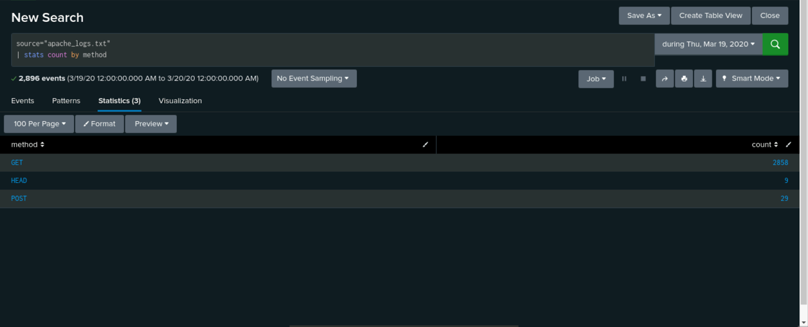
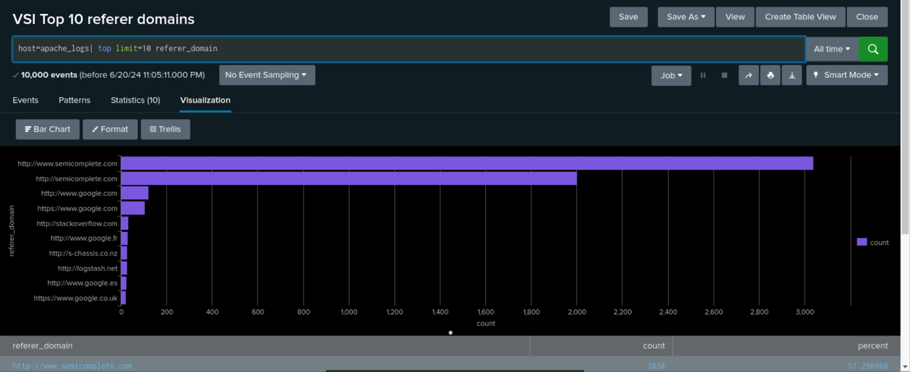
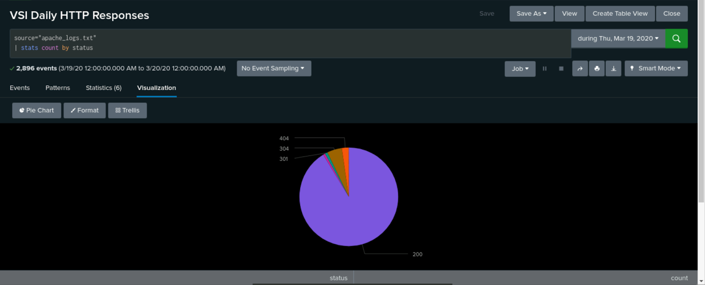
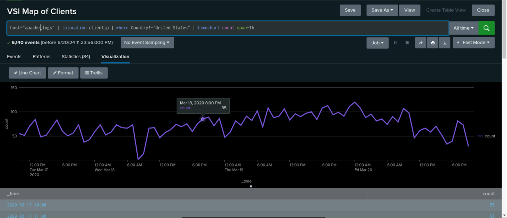
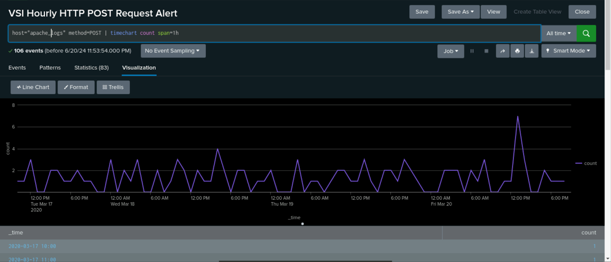
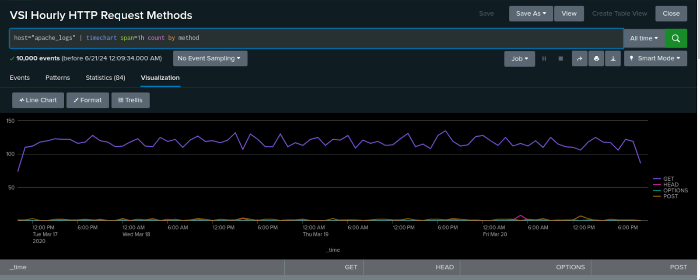

<h5>Directory</h5> 

<b>[Tech Portfolio Home](https://github.com/Jays1115/Jalen-Smith.git)</b>

# VSI's Custom Splunk Environment

Scenerio: As a SOC Analyst at Virtual Space Industries (VSI), a company specializing in virtual-reality programs for businesses, I was tasked with investigating potential cyber threats. VSI received intelligence indicating that a competitor, JobeCorp, may be planning to launch cyberattacks to disrupt VSI’s business operations.
<br>
<br>
Assignment: The VSI product assigned for monitoring is an Apache web server, which hosts the administrative webpage. The networking team has provided past logs to assist in developing baselines for normal activity, as well as creating reports, alerts, and dashboards to effectively monitor for suspicious activity and potential threats.

<h2>Creating Reports, Alerts, & Visualizations From the Apache Logs</h2>
After uploading the provided logs from the Apache web server, I designed the following reports, alerts, & visualizations to assist VSI in quickly identifying specific information.
<br>
<br>

<p align="center">
<br/>
This is a report that shows a table of the different HTTP methods (GET, POST, HEAD, etc.). This will provide insight into the type of HTTP activity being requested against VSI’s web server.
<br/>

<br/>
<br/>
This report shows the top 10 domains that refer to VSI’s website. This will assist VSI with identifying suspicious referrers.
<br/>

<br />
<br />
This is a report that shows the count of each HTTP response code. This will provide insight into any suspicious levels of HTTP responses.
 <br/>
 
 <br/>
<br />
<br />
This is a line chart that shows the volume of international website activity. This will provide insight into suspicious volume of international activity.
 <br/>
 
 <br />
<br />
This is a report that shows the volume of HTTP POST request codes to the web server. This will provide insight into the volume of HTTP POST request to the server. I used this report to determine the baseline of hourly HTTP POST requests and created an alert that would send an email to SOC@VSI-company.com when HTTP POST requests exceeded 5 request per hour.
 <br/>
 
 <br />
<br />
This is a report that shows the hourly count of each HTTP request method to the server. This will provide insight into any suspicious spikes iin any HTTP request to the server.
 <br/>
 

 <h2>Analyziing Reports & Visualizations From the Apache Logs After an Attack</h2>
After uploading the provided logs from the Apache web server, I designed the following visualization to assist VSI in quickly identifying specific information.
<br>
<br>

<p align="center">
<br/>
This is a report that shows a table of the different HTTP methods (GET, POST, HEAD, etc.). This will provide insight into the type of HTTP activity being requested against VSI’s web server.
<br/>

<br/>
<br/>
This report shows the top 10 domains that refer to VSI’s website. This will assist VSI with identifying suspicious referrers.
<br/>

<br />
<br />
This is a report that shows the count of each HTTP response code. This will provide insight into any suspicious levels of HTTP responses.
 <br/>
 

 <h2>Creating Visualizations & Dashboards From the Apache Logs</h2>

<!--
 ```diff
- text in red
+ text in green
! text in orange
# text in gray
@@ text in purple (and bold)@@
```
--!>
